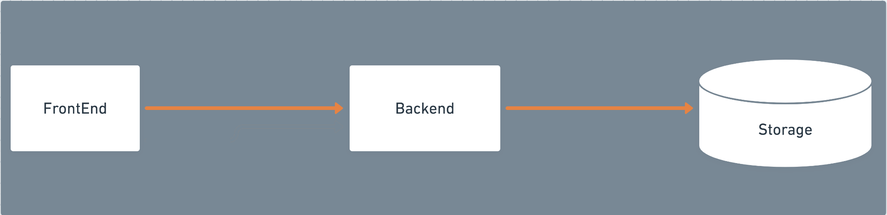

# Fire up the IDE...You have your marching orders, now GO CODE!  

## Not so fast...

Before you open your IDE, you should have 1 billion questions to ask. And this request came from the business.  It is the equivalent of "build me a house, and I don't care how you do it." They do care greatly *HOW* it functions, but not the materials per se. Two, three, or five bedrooms? One story or two?. Time to start asking questions. The business team knows everything about pricing, inventory, and retail accounting, but nothing about technology.  To make a decision, you first need to understand your options and what they want (and what they are willing to pay for).  What if you went to Chipotle and they took down their menu but you still had to order?  You would end up asking lots of questions.

We have an old joke in IT when projects start:  Good, Fast, Cheap: Pick two; the other goes the wrong direction. 😄

## Start with a Whiteboard (or pen and paper)

The most basic pattern of business software that has evolved over the last few decades is the 3 tier architecture.  It allows `Separation of Concerns` between:  

* Front End: Showing the data (browser)
* Back End: Processing the data (server)
* Storage: Storing the data (database)

In theory (but rarely in practice), you can swap each tier out without impact to the others.

[Front and Back Ends (wikipedia)](https://en.wikipedia.org/wiki/Front_and_back_ends)

## Three Tier Architecture

For simplicity, we will stay hard inside this 3 tier architecture, and as we needed, we will add layers inside each of the tiers.

So just like the Chipotle choices, in the beginning, you can independently choose what you want for each option.  Taco + Steak + Guacamole or Burrito + Chicken + Corn Salsa. Once they make it, the components are hard to swap out, so I can't stress enough that if you aren't sure, consult somebody who has been punched in the nose a few times. It will save you tons of heartache, late nights, and slobbering crying. I promise. Erasing a line on the whiteboard at the beginning of the project is a lot easier (and cheaper) than refactoring a major component 3 months later because you didn't consider volume.

So, I like to work "bottom-up" on these.  Why? Because **[Data has gravity](https://www.cio.com/article/3331604/data-gravity-and-what-it-means-for-enterprise-data-analytics-and-ai-architectures.html)**. You can have the prettiest UI in the world, but if your data is slow to access or unreliable, then it doesn't matter.

## Microservices and REST

A quick note from an "old guy", technology history is fun to me. You really can't understand where somebody is unless you know where they came from and what path they traveled.  Technology has created a full graveyard of libraries, companies, hardware, platforms, etc. So, the following two words get tossed around, and although they are great, what they are is much better than their predecessors.

**Microservices** was a pendulum swing from the "monolith." Projects built 10+ years ago were 1 *BIG* application: `The inventory app`.  It was 10,000s of lines of code, and all deployed at once. Deploying it was a 12-hour affair that happened overnight with 20 people in a room and another 30 on-call with all these super complicated "back out plans."  It was a nasty slow business.

Enter Microservices. The idea was to "break apart' the monolith into small tiny "microservices." Each microservice could be independently deployed, scaled, and rolled back. One of the best things this did for us was halt the dreaded `overnight deployment`.

Enter REST, if you are going to break apart the monolith to microservices, then you need to define a clean way for these microservices to communicate with each other. REST is an excellent, reliable standard, using the HTTP protocol to establish the way things "talk" to each other.  Generally, it is between Front End and Back End and from Back End to additional Back Ends. The database is usually a protocol like JDBC.

## [NEXT -->](04-database.md)