# Hello World

For all the remaining technical steps, I will state the Goal and then the Technical Details. 

The Goal will be stack agnostic, but the Implementation Details will be for the System Architecture on the previous slide. 

If somebody wants to follow along using Golang and MySQL, they should have little problem working within that stack and following along.


## Goal

Set up your dev environment on your laptop and run a simple "hello world" app. 

## **Implementation Details**

For this stack, we need to install a few key things on your laptop. Again, this is very specific to the stack that we picked on the previous slide, but you are welcome to make small adjustments for yourself.  I will always try to make the task clear outside of the technology. 

Also, I will not give every last detail on how to accomplish some of these goals.  This will help you to learn to depend on Google to figure out some of the "sharp edges".

1. Jetbrains IntelliJ (Free Community Edition is fine)
2. Java 8


### **IntelliJ**

IntelliJ is one of the best Java IDEs (Integrated Development Environment) on the market. But IDEs are like people's kitchens: they have them set up exactly as they want and cooking in somebody else's kitchen can be frustrating. (Where are the whisks! And the Whisky!)

Some people love VSCode, others Eclipse.  To each their own. We are using IntelliJ.  Feel free to follow your heart :D

So google the steps to install IntelliJ and come back here when finished. 


### **Java 8**

I guess you could use any version of Java >= 8, up to you, but I'll be focusing on Java 8 since it is still in heavy use. 

[Here is a great article from Summer 2019 on multiple java versions.](https://medium.com/@brunofrascino/working-with-multiple-java-versions-in-macos-9a9c4f15615a)

On my mac, I opened a terminal and ran:

```
/usr/libexec/java_home -V
```

which lists all the versions of Java on my machine.  

If Java8 is missing then use `homebrew` to correct the issue and install java8. 


## **Run Hello World**

1. Open IntelliJ. You should see the splash screen. Click on "Create New Project".  If you don't see the splash screen then click `File --> New --> Project`

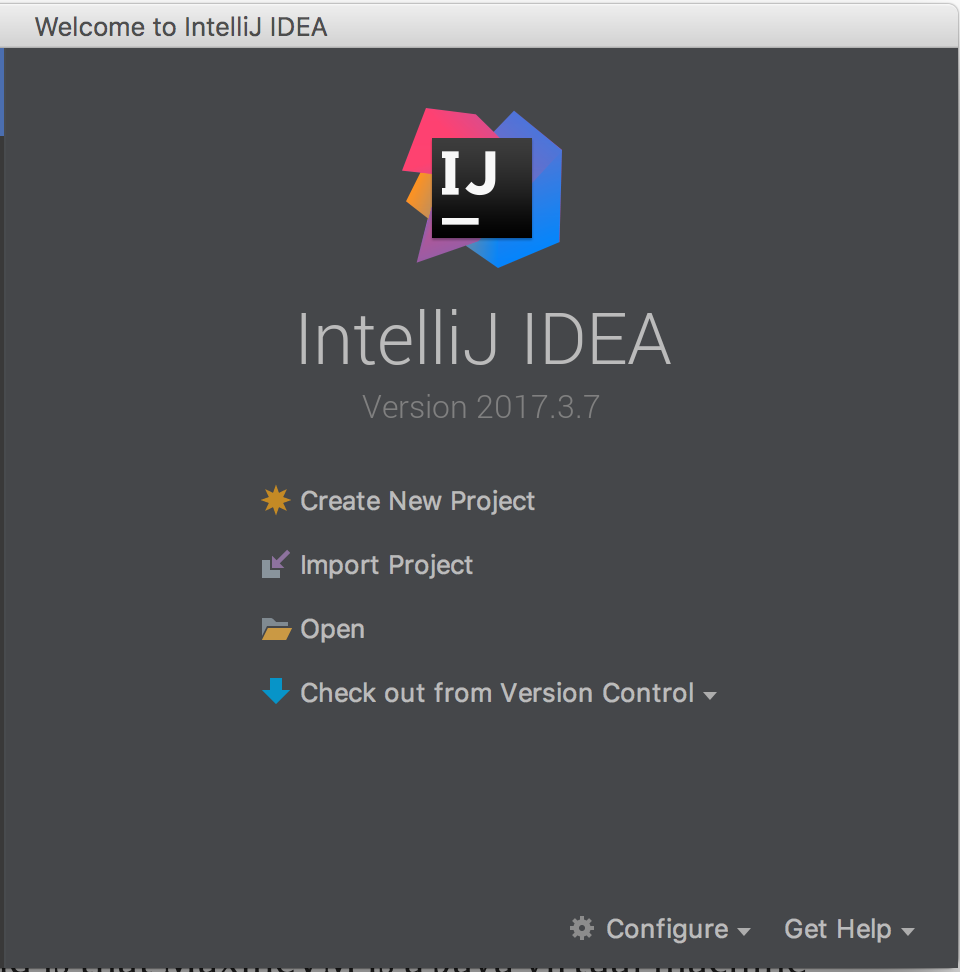

2. You will then see a list of tons of quickstart templates.  Choose `Java` at the top left, and just make sure the Project SDK is defined.  If not, click `New` and follow the steps to define a JDK.  See the section above from Java8.  

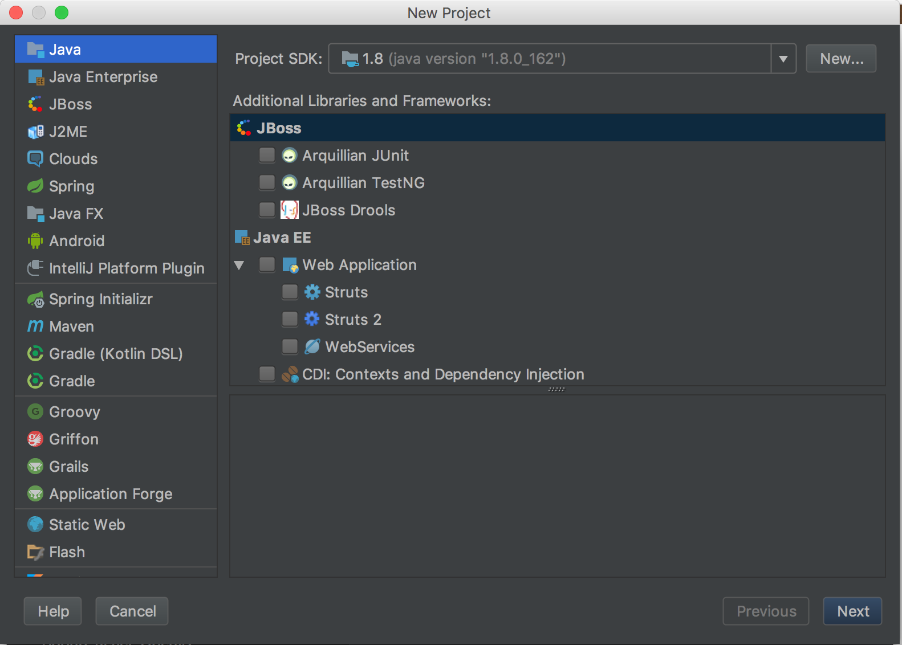

3.  Check the "Create project from Template" box and choose "Java Hello World"

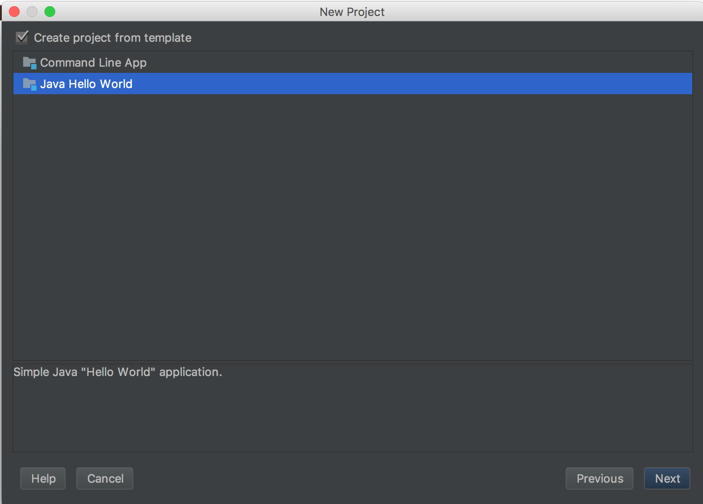

4.  Specify a Project Name and where you want the files to be placed on your file system

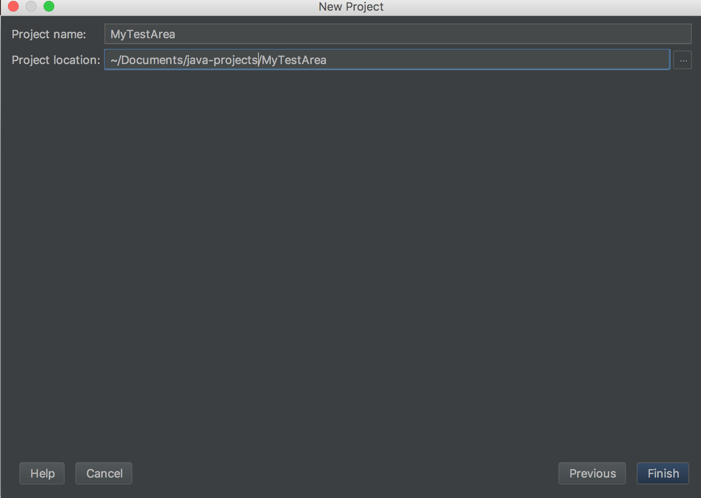

5.  Click Finish, and the project will open

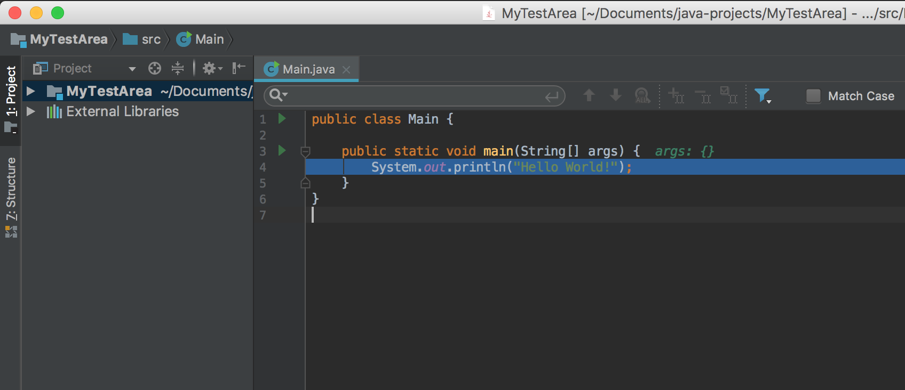

6.  The code may be collapsed, if so, click on the plus sign next to the code so it expands out

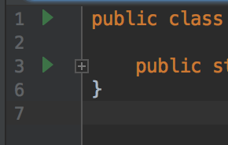

7.  Now let's run our simple project

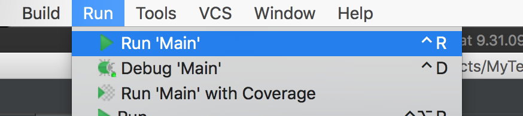

8.  This will open the program's "standard out" console at the bottom of the project window

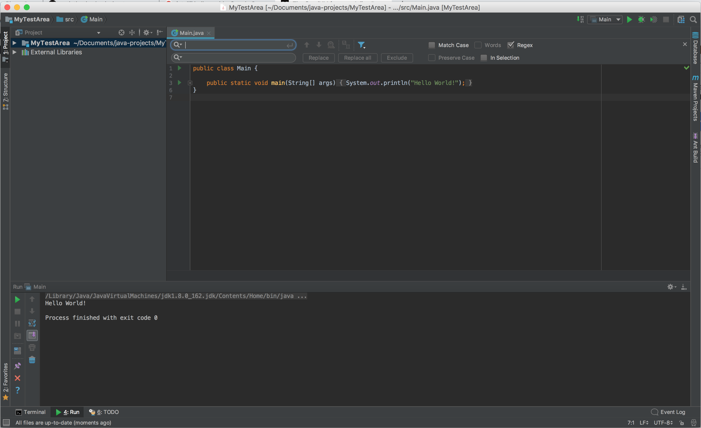


## **Debug Hello World**

Quick steps to run through the Debugger. It's one of the most powerful tools in your programming toolbox. Let's run the exact same steps as above but this time with debug turned on and a breakpoint. 

1. Set a breakpoint next to the Println statement. 

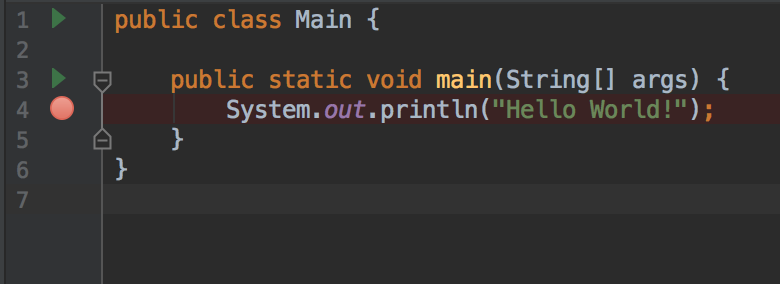

2. Run with debug 

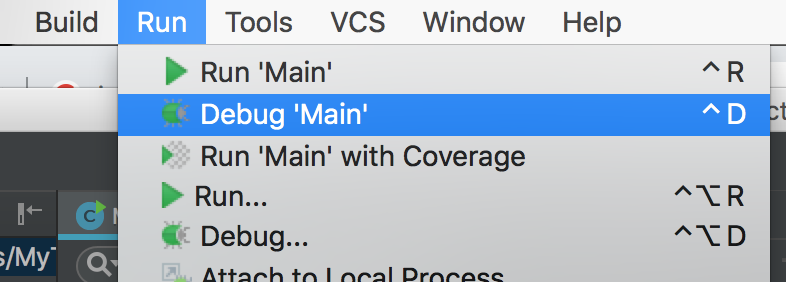

3. You will now see the breakpoint "hit" and the code execution will halt.  It will wait here indefinitely

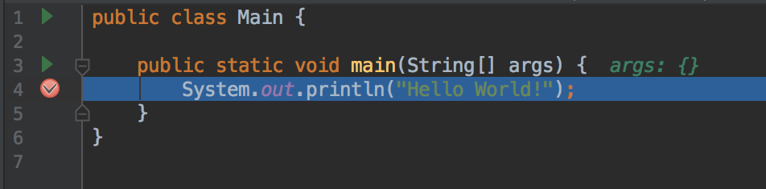

4. The debugging panel will appear to the bottom. There are a bazillion options. but let's focus on just a handful of key tools:

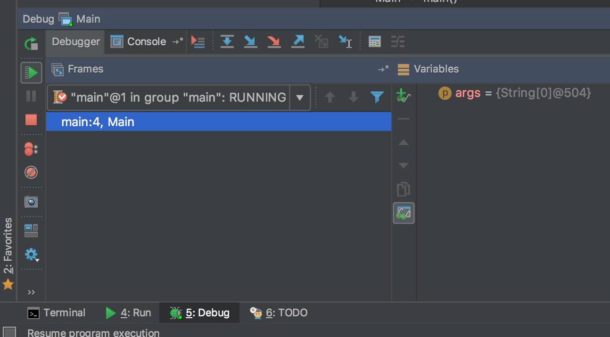

* The "play" button at the top left which tells the code to run forward until it hits the next breakpoint or the end of the program. 
* To the right of the word "console" are a set of blue arrows. These are very powerful and will become your best friends.  We will cover them in more detail in the future, but set some breakpoints and have fun playing and learning.  They are:
  * Step Over
  * Step Into
  * Step Out
  * Run to Cursor

* Note: The "Step" buttons all have corresponding keystrokes which are super useful and good to memorize or write on a post-it note next to your monitor. 

## [NEXT -->](09-rest-layout.md)
