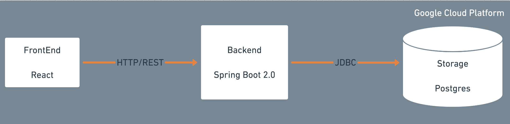

# Skeleton Backend

Remember this picture from a few slides back in this bootcamp?




We are going to start in the "middle" with the backend, then work to the right.  

We now know what our API should look like for our products. 

## Goal

Create a starter backend.  No database... yet. Just get a couple of REST endpoints alive with some fake data.  Maybe a unit test or two. 

## **Implementation Details**


### Starting is hard

Starting a project is usually the hardest part of the task.  So many decisions to make. Project structure, all the little pieces that need to fit together.  Lucky, more and more languages have the idea of the "starter template" these days.  Create React App, Spring Initilizer, etc. 


### Spring Initializr

1. Open up [start.spring.io](https://start.spring.io/)

This lets you create create a project with many different Spring-ness wired in auto-magically.  We will take this super slow. Focus only on the REST Controller first. 

2. Choose the following items:

```
Project:            Gradle  
Language:           Java  
Spring Boot:        Highest Non-Snapshot Release  

Project Metadata:
Group:              com.houseawesome
Artifact:           RetailBackend
Options:            Make sure Jar and Java8

Dependencies:
+ Spring Web
+ Spring Data JDBC
+ PostgresSQL Driver
+ H2 Database


NOTE: What about JPA? For the moment, I want to show JDBC connectivity between the code and the database.  After you learn this, you want to go back and add JPA? Knock yourself out. 
```

3. Click "Generate" at the bottom

A zip file will download to your laptop.  If you are on a Mac, then the file will be called RetailBackend.zip and will be in your ~/Downloads directory.  Open your terminal/iTerm2 and move this file to where ever you want to expand the zip file. For me, this is the command I run: 

`mv ~/Downloads/RetailBackend.zip ~/Documents/`

4. Check the zip file.  

Lets look into the zip file without exploding it. I want to make sure all the files are in a "root" directory:

`unzip -l RetailBackend.zip`  
OR  
`jar -tvf RetailBackend.zip`

You can see that there are just less than 30 files and they are all inside a directory called "RetailBackend". 

5. Explode the zip file

`unzip RetailBackend.zip`


## **Further Reading and References**

* https://developer.okta.com/blog/2018/12/13/build-basic-app-spring-boot-jpa

* https://spring.io/guides/gs/accessing-data-jpa/


## [NEXT -->](11-explore-the-project.md)