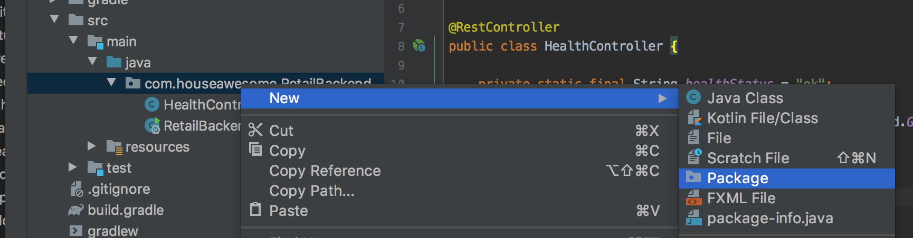
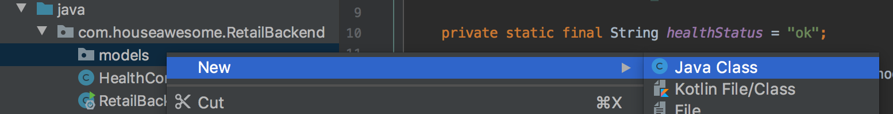

# Building the Layers

Now lets start to flush out our MVC layers. 

A few chapters back, we built our first rest end point.   Lets build a real end point and a unit test to go with it. 

## Our First Product

1. Create a new java package.  

We need to create three new package in java to hold our models. So right click on the existing src folder and choose New and Package.  Add the two packages listed below:

```
com.houseawesome.RetailBackend.models.dao
com.houseawesome.RetailBackend.models.services
```



2. Then add our first model. `Product`

Add a new Java class to the `com.houseawesome.RetailBackend.models.dao` package you created above. The class should be called "Product". (singular)



Then copy the below code into Product.java, replacing everything that was created:

```
package com.houseawesome.RetailBackend.models.dao;

import java.math.BigDecimal;
import java.math.RoundingMode;
import java.util.UUID;

public class Product {

    private UUID id;
    private String name;
    // https://stackoverflow.com/questions/12496555/java-best-type-to-hold-price
    private BigDecimal price;

    public UUID getId() {
        return id;
    }

    public void setId(UUID id) {
        this.id = id;
    }

    public String getName() {
        return name;
    }

    public void setName(String name) {
        this.name = name;
    }

    public BigDecimal getPrice() {
        return price;
    }

    public void setPrice(BigDecimal price) {
        this.price = price;
        this.price.setScale(2, RoundingMode.HALF_EVEN);
    }
}

```

3. Lets unpack our `Product` model. 

Lets quickly unpack this. Above is a simple object to hold Product information. It will hold the data from the database and pass it to the controller.  Or it will be created in the controller and passed to the DAO. Very useful. 

4. Create Product Service

This is the business logic abstraction layer. This will allow easier testing by seperating out the logic into super small building blocks. 

Add a new Java class to the `com.houseawesome.RetailBackend.models.services` package you created above. The class should be called "ProductService". Then copy the blow code:

```
package com.houseawesome.RetailBackend.models.services;

import com.houseawesome.RetailBackend.models.dao.Product;

import java.math.BigDecimal;
import java.util.UUID;

public class ProductService {

    public Product getProductByID(UUID productID) {

        Product product1 = new Product();

        product1.setId(productID);
        product1.setName("Exterior Paint");
        product1.setPrice(new BigDecimal("24.99"));

        return product1;
    }
}
```


5. Create Product Controller

In the `com.houseawesome.RetailBackend.controllers` package, we need to create another controller.  This time, I'm not going to give you the steps. I've already covered them. Can you remember?

Once you create the ProductController java file, copy the below code and replace it all:

```
package com.houseawesome.RetailBackend.controllers;

import com.houseawesome.RetailBackend.models.Product;
import org.springframework.web.bind.annotation.PathVariable;
import org.springframework.web.bind.annotation.RequestMapping;
import org.springframework.web.bind.annotation.RequestMethod;
import org.springframework.web.bind.annotation.RestController;

import java.math.BigDecimal;
import java.math.RoundingMode;
import java.util.UUID;

@RestController
public class ProductController {

    @RequestMapping(value = "/products/{productID}", method = RequestMethod.GET)
    public Product getProduct(@PathVariable("productID") UUID productID) {

        Product product1 = new Product();

        product1.setId(productID);
        product1.setName("Exterior Paint");
        product1.setPrice(new BigDecimal("24.99"));

        return product1;
    }
}
```

See the words that are added just before the classes and methods that start with `@`?  Those are called [annotations](https://en.wikipedia.org/wiki/Java_annotation). They "inject" functionality without having to copy and paste the [boilerplate code](https://en.wikipedia.org/wiki/Boilerplate_code).  They are very powerful, but warning, they can also cause unintended side effects.  So be careful.  

Hacker Note: If you want to dig into what an annotation actualy does (and set break points to walk the code). just press the Command key and click on the annotation in IntelliJ, and you will go into the code of the annotation.  I did this two years ago and for the better part of two days, ran and debugged the OAuth2 annotations. SO. MUCH. LEARNING!)

5. Execute the API

Now Restart, Run, or Debug the application, and using either curl, postman, or browser (I always recomment postman), hit the endpoint. side note, if on a mac the `uuidgen` command is great to generate UUID on the fly. 

```
$ curl -s 'http://localhost:8080/products/77A313EC-9C69-4D8B-A4D4-04117DB4EEB1'
{
  "id": "77a313ec-9c69-4d8b-a4d4-04117db4eeb1",
  "name": "Exterior Paint",
  "price": 24.99
}
```

BOOM! :D 