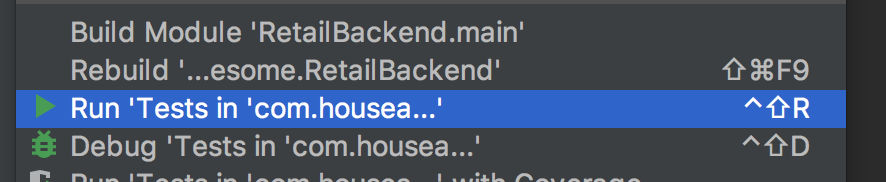
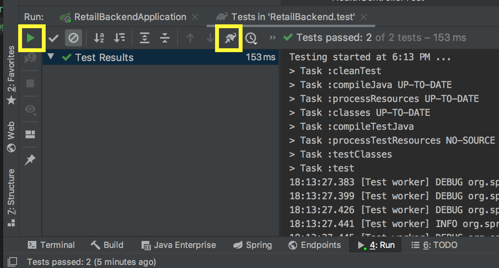
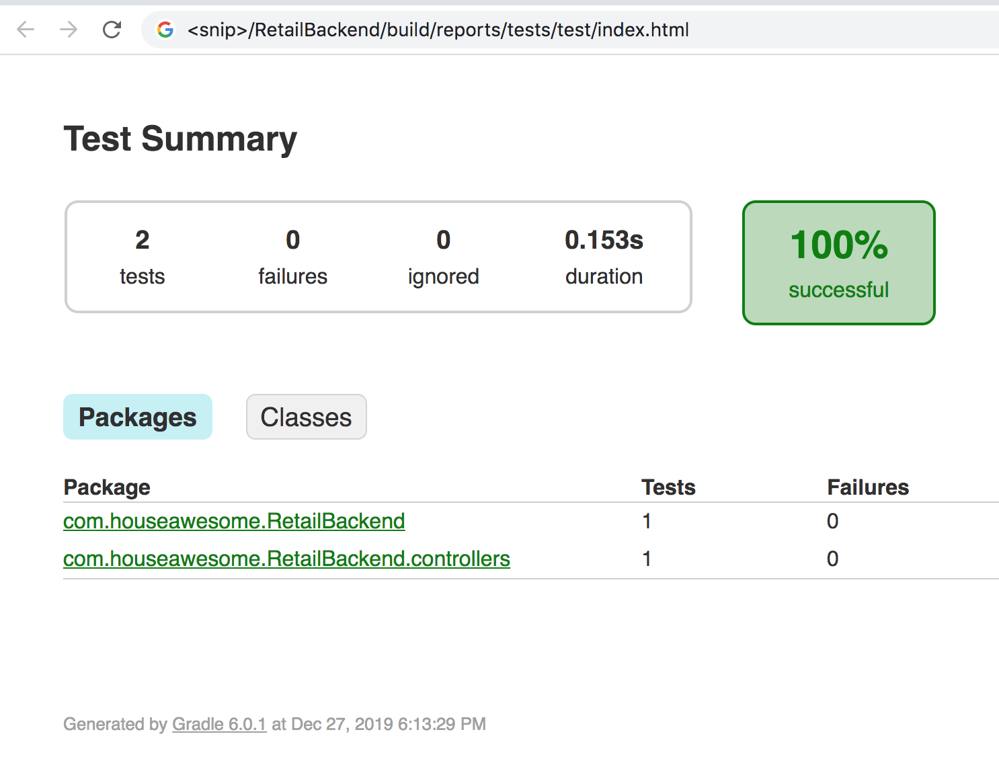

# Unit Testing

Time to take a small side step and dig into unit testing. Unit Testing can seem to be Black Magic, but once understood and mastered, it is one of the most powerful tools in your toolbox to make sure that your code does what you expect it to. It also lets you make changes without fear of introducing unintended outcomes. 

## What is Unit Testing?

`Unit testing` is, quite simply, testing the smallest component (unit) of work possible, with as much isolation as possible. The idea is, with high quality unit tests, you can build up a solid confidence that the code does execute exactly as expected, even after a change. There are 1 million, blogs, videos, books about unit testing.  So feel free to google around some on the topic. 

The other thing about Unit Test is that you should be able to execute the tests with ZERO external depedencies. This is so that we can isolate the code in question. 

If you want to test against a live database, then that is called an `integration test` and requires you to setup a database. 

If you want to test the application from end to end, that is called a `functional test` and although these tests are very powerful they are also very brittle, meaning they break with the slightest of changes. 

## SIDE NOTE: Now using JUnit5

One of the hardest thing I learned about Spring is the complex matrix of version dependencies.  It just takes time to learn. So this one bit me. Spring Boot 2 now uses JUnit5.  So in the examples, make sure it is a JUnit5 example, and not JUnit4. 

How to tell?  JUnit5 is imported using 

```
import static org.junit.jupiter
```

JUnit4 is just 
```
import org.junit
```


## /src/test is your friend

In Java/Spring Boot projects, the unit tests go under the `/src/test` folder in the exact same project structure of the class in `/src/main` that it is testing. Lets create a super simple unit test for the health component we built. 

1. Expand out `/src/test/java/` and you should see the `com.houseawesome.RetailBackend` package. 
2. Add a new package here called `com.houseawesome.RetailBackend.controllers`. This should mimic what is already in `/src/main/java`. 
3. Add a new Java Class called `HealthControllerTest` then copy the code from below:
```
package com.houseawesome.RetailBackend.controllers;

import org.junit.jupiter.api.Assertions;
import org.junit.jupiter.api.Test;
import org.springframework.beans.factory.annotation.Autowired;
import org.springframework.boot.test.autoconfigure.web.servlet.WebMvcTest;

import org.springframework.test.web.servlet.MockMvc;
import org.springframework.test.web.servlet.MvcResult;
import org.springframework.test.web.servlet.request.MockMvcRequestBuilders;

import java.net.URI;


@WebMvcTest(HealthController.class)
public class HealthControllerTest {

    @Autowired
    private MockMvc mockMvc;

    @Test
    public void testHealthController() {

        try {
            final String baseUrl = "http://localhost:8080/health";
            URI uri = new URI(baseUrl);

            // Execute the call.
            MvcResult results = mockMvc.perform(MockMvcRequestBuilders.get(uri)).andReturn();

            // Validate the call was successful and the data that came back was as expected.
            Assertions.assertNotNull(results);
            Assertions.assertEquals(200, results.getResponse().getStatus());
            Assertions.assertEquals(2, results.getResponse().getContentLength());
            Assertions.assertEquals("ok", results.getResponse().getContentAsString());

        } catch (Exception ex) {
            // if any errors are thrown, then fail.
            Assertions.fail();

        }
    }
}
```
4. Now lets run this unit test.  If you open the context menu (right click) on anything under the `/src` directory, you will see an option that says "Run 'Tests in 'com.houseawesome.RetailBackend'' (it might be cut off). Click on that. 



This will open the Unit Test window at the bottom left.  If you make any changes, then you can rerun the tests by clicking the "play" button at the top left. 



Finally, if you click the button I highlighted to the right, that will open the browser and show you the test results.  It is actually really neat. 




## Understanding the Unit Test

If we now look carefully at the Unit test code above, we can get a feel for what it is doing.

It "calls" the URL on a local Spring Boot special controller. Then it gets the results back from the call and lets you test the results. "Expected" vs "Actual"

Super Powerful. 

This test is overly simple.  It gets more complicated as we add layers, Controllers, Business Logic, and databases.  But we will take it a step at a time in future lessons. 

## Running Unit Test in Terminal

Side Note: Gradle is actually responsible for running the unit tests, not IntelliJ.  So you can run the unit tests directly, by opening the terminal and running:

```
./gradlew clean test
```

## [NEXT -->](15-unit-testing-part-2.md)